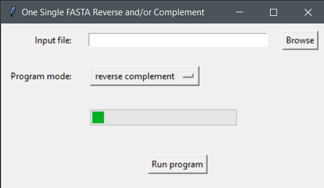

# One Single FASTA Reverse Complement

A windows x86_64 GUI app to reverse, complement or reverse complement a single-fasta file

## Installation
Download the file from the `bin` folder

## Usage

1. Click browse and navigate to your single-fasta file

2. Select to reverse, complement or reverse complement the sequence

3. Select the FASTA Width

4. Click `Run program`

Example input file with all the output files per program mode can be found in the `data` folder

Input data were derived from solgenomics.net

**Note: This program does conversion of all DNA IUPAC characters**
